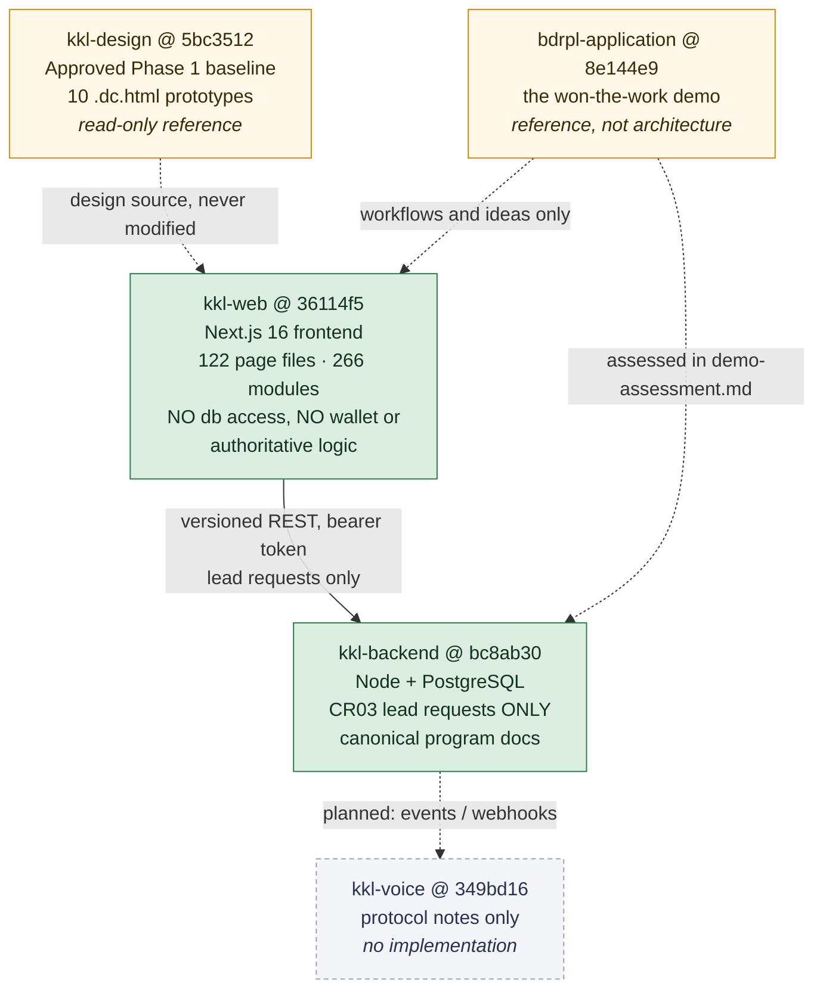
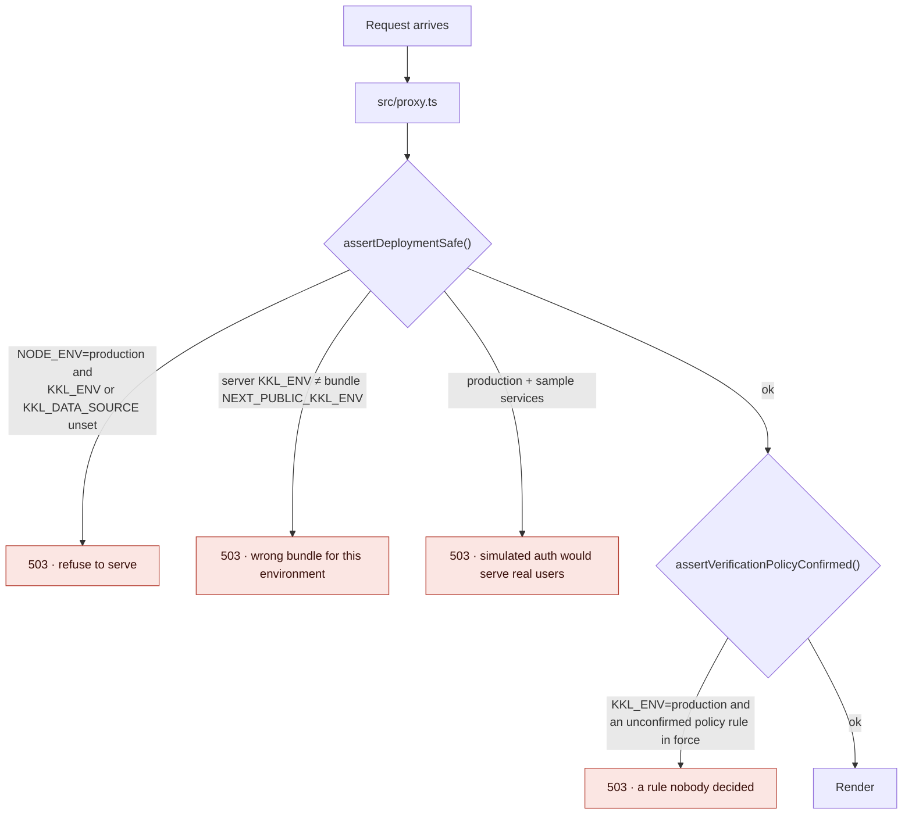

# 3. Architecture and repository boundaries

What each repository owns, what the frontend is allowed to do, and where the
boundaries are enforced rather than merely described. Versions and counts are
from `kkl-web` `36114f5` and `kkl-backend` `bc8ab30`.

## 3.1 Repository responsibilities



Solid edges exist in code. Dashed edges are either reference relationships or
planned and unbuilt.

## 3.2 Frontend stack, at the documented commit

| Thing | Version | Note |
|---|---|---|
| Next.js | 16.2.11 | App Router, Turbopack |
| React / React-DOM | 19.2.4 | Server Components; `useActionState` throughout |
| TypeScript | ^5 | `strict`; `tsc --noEmit` in CI-equivalent scripts |
| Tailwind CSS | ^4 | `@theme` block; no config file |
| zod | ^4.4.3 | Input parsing at the service boundary |
| Node | 22.x (`engines`) | Measured runtime: v22.22.2, npm 10.9.7 |
| ESLint | ^9 + `eslint-config-next` 16.2.11 | |

Runtime dependencies are four packages. That is deliberate: a frontend with no
authoritative logic needs very little.

Two Next 16 specifics shaped the code. `middleware.ts` is named `proxy.ts`, and
only a *literal* `process.env.NEXT_PUBLIC_X` member access is substituted at
build time — a computed `process.env[name]` lookup reads the live process
environment instead. That distinction was a real defect (chapter 08 §8.7).

## 3.3 Routing and layout

122 `page.tsx`, 9 `route.ts`, 6 `layout.tsx` across `src/app`. Route groups
carry the boundaries:

| Segment | Layout | Audience |
|---|---|---|
| `src/app/(public)` | public header + deep-blue footer | Home seekers, and the individual owner |
| `src/app/seller` | `SellerShell` → `ConsoleShell` + rail | Brokers and agencies |
| `src/app/builder` | `BuilderShell` → `ConsoleShell` + rail | Builders |
| `src/app/admin` | `AdminShell` → `ConsoleShell`, dense rail, ink tone | Internal staff |
| `src/app/actions` | — | 20 server-action modules |

The owner journey (CR02) sits inside `(public)`, not in a console. That was a
deliberate choice: an individual owner is not a subscriber and not a
lead-buying broker, and putting them behind a dashboard rail would have said
otherwise. Chapter 05 §5.6.

`ConsoleShell` is shared by all three consoles and takes `items`, `footer`,
`tone` and `dense`, so the Admin rail's twenty destinations and tighter step are
a parameter rather than a fork.

## 3.4 Components and styling

Seventeen component folders, 39,383 lines of TypeScript/TSX across 266 modules.

`src/components/ui` holds five primitives — `button`, `card`, `chip`, `field`,
`states`. Everything else composes them. Two rules from the approved design are
enforced in the primitives rather than left to call sites: labels sit above
fields and stay there, and every control is at least 44 px tall. A disabled
field always says why it is disabled.

Colour, type and spacing are tokens in a Tailwind v4 `@theme` block, extracted
from the prototypes' own markup. That is what lets `verify-design-tokens.mjs`
check the implementation against the design's source values rather than against
a second hand-written list.

## 3.5 Configuration and the deployment guard

`src/lib/config/runtime.ts` resolves two values — a deployment environment and a
data source — and refuses unsafe combinations. It is the most load-bearing
non-feature module in the repository, so its design is worth stating.



Two things about this are easy to get wrong and were got wrong once.

**The build-time/run-time split.** `NEXT_PUBLIC_*` values are frozen into the
bundle. A guard that reads only those cannot catch the likely accident — a
bundle built for review, deployed to production with production variables set on
the server. So the authoritative run-time values are the *unprefixed* `KKL_ENV`
and `KKL_DATA_SOURCE`, read from the process on every request, and compared
against the inlined ones. When both sides were read through the same helper the
comparison could never disagree; that was a defect (chapter 08 §8.7).

**What it cannot do.** It cannot tell where it is running. Nothing available to
a Node process distinguishes a production host from a laptop, and it does not
guess from hostnames. It requires the deployment to *declare itself*, and
refuses when the declaration is missing. A deployment that declares
`KKL_ENV=review` while serving real users is not detectable here, and that
residual risk is stated in the module.

`assertVerificationPolicyConfirmed()` (CR07, PRM-017) **cannot currently fire**,
because the guard before it refuses production-with-sample and an `api` build
needs a backend client that does not exist. It is in place for the day that
client lands, and the code says so rather than implying an active control.

## 3.6 Server and client responsibilities

Data fetching is server-side; every page is a server component that calls
`getServices()`. Client components exist only where behaviour requires them —
forms using `useActionState`, the locality combobox, the unsaved-changes guard,
toggles.

Every mutation is a server action in `src/app/actions/`. None takes an account
identity from the client: the service resolves it server-side. Where a scope
*is* a form field (the two lead marketplaces are separate pools), it is
validated against an allow-list and the code comment records why — the standing
instruction from PRM-009 that "a hidden scope field is untrusted input, not
authorization".

## 3.7 Backend structure

```
kkl-backend/
  migrations/001_lead_requests.sql    schema, RLS policies, identity helpers
  migrations/002_app_role.sql         kkl_app: not owner, NOBYPASSRLS, no password in repo
  migrations/003_account_external_ref.sql  stable external handle; session expiry
  migrations/004_multiple_areas.sql   area_ids text[] + GIN index
  src/db/pool.mjs                     withIdentity() — SET LOCAL per transaction
  src/db/migrate.mjs                  ordered, idempotent migration runner
  src/domain/lead-requests.mjs        validation, idempotency, projection
  src/http/sessions.mjs               session issue/resolve/revoke + dev authenticator
  src/http/server.mjs                 versioned REST surface
  tests/{lead-requests,rls,durability}.test.mjs
```

One runtime dependency (`pg`). The REST surface is nine routes. Chapter 06 §6.5
covers the authorization model; chapter 11 §11.5 covers what it does not prove.

## 3.8 Planned but not implemented

Stating these plainly matters more than the list of what exists.

| Component | Status | Where it is specified |
|---|---|---|
| Authentication (mobile OTP, sessions, staff accounts) | **Not built.** A development authenticator stands in | `kkl-backend/docs/architecture.md` §4 |
| Payments, wallet, settlement | Sample only — numbers in one process | D-01, D-03, D-13, D-14 |
| KYC provider integration | Sample only — no provider selected | chapter 09, CR07 |
| Media storage, virus scanning, retention | **Not built.** Owner photographs are recorded by name only | chapter 09, CR02 |
| Lead marketplace, notifications, voice | Sample in `kkl-web`; unbuilt in `kkl-backend` | `kkl-backend/docs/architecture.md` §2 |
| Redis workers / queues | Planned, unbuilt | `kkl-backend/docs/architecture.md` §3 |
| `kkl-voice` | Protocol notes only, one commit | `kkl-voice` `349bd16` |
| kkl-backend API client in `kkl-web` | **Not built.** `getServices()` throws for `dataSource=api` | `src/lib/services/index.ts` |

The last row is why an `api`-mode production build cannot currently be produced,
and why the CR07 production guard cannot fire.
