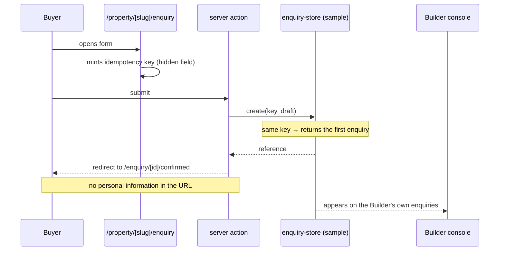
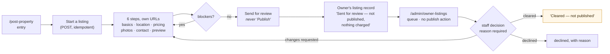
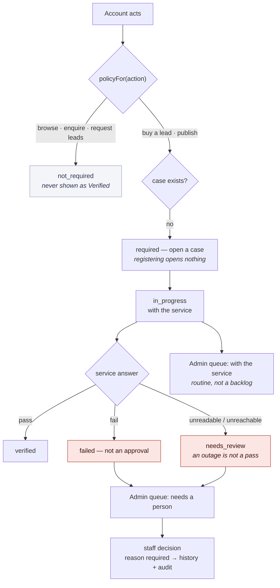

# 5. Role journeys and screen implementation

Six audiences, what each can do, and where the boundaries between them are
enforced. §5.8 resolves the three screen counts that are easy to conflate.

## 5.1 Public portal and Buyer (P-01 … P-21)

The brief made this the primary experience, not a front page for the
marketplace. `src/app/(public)` carries a light header on white and a deep-blue
footer; 21 inventory rows.

Homepage search (location, property type, BHK, budget) over the CR05 location
records; search results with filters and sorting; property detail with gallery,
specifications, amenities and enquiry/site-visit actions; a requirement-capture
flow (`/find-my-match`) with budget-weighted match scoring (`cbb4ba3`);
shortlisting; and a Buyer area for enquiries, profile and notifications.

**The enquiry flow** is the most heavily verified path in the repository
(`verify-enquiry-flow.mjs`, 17 checks), because PRM-006 asked for it to be
proven beyond the happy path:



Verified: reload and direct access to the confirmation, repeated submission, two
tabs, two independent browser sessions (one cannot reach the other's draft),
expired OTP, expired and missing drafts, and draft clearing.

## 5.2 Seller / broker console (S-01 … S-25)

25 rows. Registration and onboarding, KYC submission and status, the masked lead
marketplace ("Buy Leads" after CR01), lead detail, purchase, purchase result,
My leads, CSV export, billing and credits, recharge, invoices, support, profile
— and, after CR03 and CR04, lead requests and My purchases.

**Masking is structural.** The marketplace type has no contact fields; the
purchased type does. `tests/access-boundaries.test.mjs` asserts the rule over
every combination, not just the walked paths, and the CR04 browser suite asserts
that no phone-shaped string appears in the served HTML before an order.

## 5.3 Builder console (B-01 … B-24)

24 rows. Registration, verification, subscription (with no price — D-01),
listing management, and the six-section listing editor B-08…B-13.

**B-15**, the unsaved-changes experience, took three prompts and remains an open
exception. In-app navigation offers Save / Discard / Keep editing; edits survive
staying; the dirty state clears after a save. Browser **Back** leaves without the
custom dialog — and the resolution was to make that *harmless* rather than to
trap history:

> Forward restores the unsaved edits with an "Unsaved work restored." notice, and
> nothing is ever silently saved; a second tab reads the server value.

PRM-010 explicitly forbade the alternative: "Do not introduce a fragile history
trap just to report a pass." E-P1 is open for a decision, with a screen
recording and a labelled frame strip as evidence.

## 5.4 Admin console (A-01 … A-31)

31 rows, the largest group: dashboard, users and account detail, KYC queue and
document review, property review, lead intake and qualification oversight,
orders and delivery, wallets and adjustments, refunds, subscriptions, support,
notifications, reports, audit and system settings.

Three structural rules, each from an explicit instruction:

- **Reason-gated decisions.** Enforced at the store, so no Admin mutation can
  write an audit entry without a reason.
- **Append-only audit.** Entries are only ever `unshift`ed; a mistake is
  corrected by a new entry.
- **Three separate axes.** Verification, account status and listing moderation
  never read or write each other. `tests/access-boundaries.test.mjs` asserts the
  separation across every combination.

**A-07** is part of A-06's review flow, not a standalone page — stated in
PRM-009 and implemented that way.

## 5.5 Seller lead requests through Admin response (CR03)

```mermaid
sequenceDiagram
    participant S as Seller
    participant W as kkl-web (server)
    participant K as kkl-backend
    participant DB as PostgreSQL
    participant AD as Admin

    S->>W: area + requirements, one submit
    W->>K: POST /v1/lead-requests (bearer, idempotency key)
    K->>DB: BEGIN; SET LOCAL app.user_id/app.user_role
    DB-->>K: row + reference (RLS: lr_insert)
    K-->>W: LR-…
    W-->>S: reference, visible in My Lead Requests
    AD->>K: GET /v1/lead-requests (staff session)
    Note over DB: lr_select — own rows OR staff
    AD->>K: POST …/messages (public) and …/status (reason required)
    Note over DB: lrm_select hides internal notes from the requester
    K-->>S: status, public reply and history on the Seller's own view
```

Internal notes are withheld **by database policy**, not by a filter the next
screen has to remember; the Seller-facing type has no field that could carry
one. Both locks are asserted — `verify-lead-request-flow.mjs` check 11 looks in
the full HTML, and `kkl-backend/tests/rls.test.mjs` queries past the handlers.

## 5.6 Owner property submission and review (CR02)

Eleven inventory rows (`CR02-01`…`CR02-11`), added by the client change.



Three things this journey refuses to say. The button is **"Send for review"**,
never Publish. **"Cleared" is labelled "Cleared — not published"** everywhere,
because people read "Approved" as "it is up" and the publication terms are
undecided. And the photographs step states that **the files are not stored** —
the picker is real, the names are recorded, the bytes go nowhere, and the Admin
screen tells a reviewer that a photograph review is not actually possible.

## 5.7 Selective verification routing (CR07)



`not_required` and `verified` are different answers and the type keeps them
apart. The checking is done by a labelled **sample verification service**; no
provider is selected and no compliance is claimed.

## 5.8 Three counts that are not the same number

This has been confused before, and the distinction is load-bearing.

| Count | Value at `36114f5` | What it is |
|---|---|---|
| `page.tsx` files under `src/app` | **122** | Route *definitions*. A `[id]` segment is one file serving unlimited addresses |
| `verify-route-sweep.mjs` entries | **134** | Addresses *exercised*, with concrete identifiers, at two widths = 268 renders. 127 distinct paths + 7 query-string variants |
| `inventory.json` rows | **132** | *Screens and their states* from the design inventory, plus the CR additions. One row can be several states of one route, or a shared component with no route at all |

PRM-011 said it directly: "Do not treat every inventory entry as a separate
route." The historical figure quoted in that prompt — 113 inventory entries — was
correct at 23 September; 19 CR rows were added on 27 September.

Two route files are deliberately absent from the sweep:
`/seller/orders/[reference]` and `/builder/orders/[reference]`, because an order
reference is minted when a lead is bought and nothing is seeded as purchased.
Seeding one would change the Seller's opening balance and the counts other suites
assert; `verify-lead-order-flow.mjs` drives those screens against a reference it
creates, which is the stronger check.
