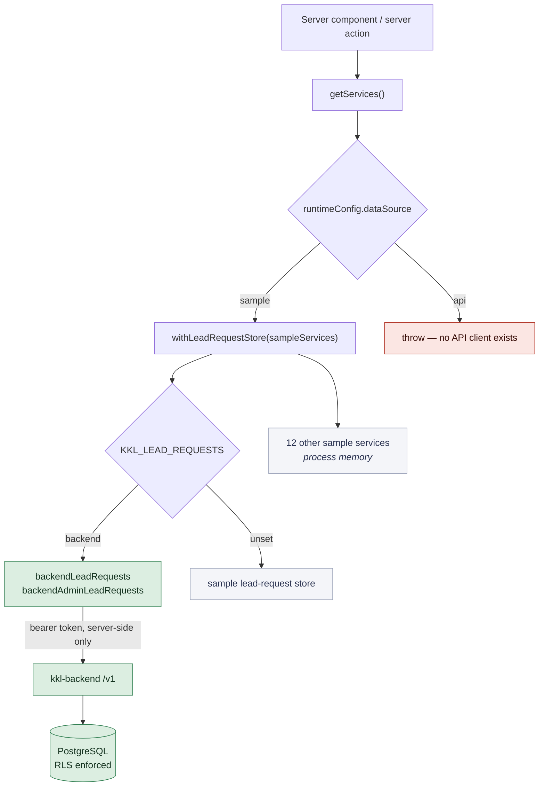

# 6. Data services and backend integration

The service boundary, the sample stores behind it, and the one domain that is
genuinely persistent.

## 6.1 The boundary



`src/lib/services/index.ts` resolves one implementation and **never falls back**.
If a deployment asks for the real API it gets the real API or it fails, because
a simulated purchase presented as real is worse than an outage.

## 6.2 Why lead requests get their own switch

The `sample` / `api` choice is about the *whole platform*, and `kkl-backend` has
built exactly one domain. CR03 is the one domain the client required to be
stored, and no arrangement of frontend code can satisfy that — so
`KKL_LEAD_REQUESTS=backend` moves lead requests and nothing else.

It is a **swap, not a fallback**. Configured for the backend and unable to reach
it, the screens report an error; they do not quietly serve memory while the page
says records are stored. The sentence on `/seller/requests` is read from
configuration for the same reason:

| Configuration | What the screen says |
|---|---|
| `KKL_LEAD_REQUESTS=backend` | "Requests are saved by the lead-request service and stay available after it restarts." |
| unset | "In this review build, requests are kept for the session only — permanent storage is a backend dependency, not yet claimed." |

## 6.3 The sample stores

Thirteen modules in `src/lib/services/sample/`. State is held on `globalThis`
under `Symbol.for("kkl.sample.state")` via `processState()` — not in module
scope, because route handlers, pages and server actions are bundled separately
and each bundle got its own copy of a module-scope `let`. That was a real defect
(chapter 08 §8.4).

| Store | Owns | Persistence |
|---|---|---|
| `seller-store` | account, KYC, wallet ledger, purchases, orders, invoices, support | process memory |
| `builder-store` + `builder-modules` | Builder account, listings, enquiries, its own lead pool | process memory |
| `admin-store` | queues, audit log, accounts, adjustments | process memory |
| `enquiry-store` | Buyer enquiries and drafts | process memory |
| `owner-listing-store` | CR02 owner listings and the moderation queue | process memory |
| `verification-store` | CR07 cases and the sample provider | process memory |
| `lead-request-store` | CR03 fallback only | process memory |
| `locations` | 55 area records, the CR05 hierarchy | fixture |
| `lead-orders` | shared order projection | derived |

**Derived, not stored.** The wallet balance is computed from the ledger, and a
lead order is the join of a purchased lead and its ledger entry. Both were
deliberate: a balance held beside the ledger that produced it had already
drifted once (chapter 08 §8.5), and a third stored copy of an order could drift
the same way.

## 6.4 The CR03 backend slice

Four migrations, one runtime dependency, nine routes.

| Table | Purpose | RLS |
|---|---|---|
| `accounts` | display name, role, stable `external_ref` | outside RLS — read by the authenticator before an identity exists |
| `sessions` | token, account, `revoked_at`, `expires_at` | outside RLS, same reason |
| `lead_requests` | the request; locations as **stable identifiers**, never display names | `lr_select` own-or-staff · `lr_insert` own only · `lr_update` staff only |
| `lead_request_messages` | public replies and internal notes | `lrm_select` non-staff see `visibility='public'` on their own request only |
| `lead_request_history` | status transitions with mandatory reason | `lrh_select` own-or-staff · `lrh_insert` staff only |

`lr_update` being staff-only means a requester cannot rewrite their own status
even by querying the table directly. `lrm_select` is why the internal-note
boundary is a database property rather than a habit.

## 6.5 How identity reaches the policies

```
resolveIdentity(bearer)  →  { accountId, role }   ← read from the session row,
                                                     role re-read from accounts
                                                     on every request

withIdentity(identity, fn):
    BEGIN
    SELECT set_config('app.user_id',   $accountId, true)   -- transaction-scoped
    SELECT set_config('app.user_role', $role,      true)
      … handler queries …
    COMMIT
```

Four properties make this real rather than decorative, and each is asserted by a
test that would fail without it:

1. **Identity comes from the session, never the request.** A body carrying
   `accountId` or `role` is ignored; there is a test named for exactly that.
2. **`SET LOCAL` is transaction-scoped**, so a pooled connection cannot carry one
   request's identity into the next. Tested by interleaving two identities over a
   pool smaller than the number of reads.
3. **The connecting role cannot bypass the policies.** `kkl_app` does not own the
   tables, is not a superuser, has `NOBYPASSRLS`; tables have `FORCE ROW LEVEL
   SECURITY`. All three are asserted directly.
4. **Authorization is written twice** — handler checks *and* policies.
   `tests/rls.test.mjs` bypasses the handlers entirely: if the application checks
   were the only separation, every assertion in that file would fail.

`docs/architecture.md` §5 names the demo's mistake — RLS enabled with no
policies, reached through a bypassing role. This slice was built not to repeat
it, and the tests are how that is demonstrated rather than asserted.

## 6.6 What is not built

The API client for `dataSource=api` does not exist; `getServices()` throws for
it. Payments, KYC providers, media storage, notifications, the lead marketplace
and the voice service are unbuilt in `kkl-backend`. Authentication is unbuilt —
chapter 11 §11.5.
